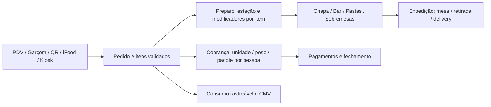

# MiseOn — plano de lançamento Natureba, operação mista e Kiosk

Data: 09/09/2026. Base local: `main`, commit `e1076b6`; árvore inicialmente limpa.
Status: plano proposto, atualizado com os requisitos de assinatura/NFS-e, iFood, notificações, workflows, Cast e oferta comercial. Não é certificação de produção.

Execução posterior em 09/09: PDF cadastral e fila de confirmação corrigidos em produção, com verificação documentada em [MISEON_HEAD_OF_ENGINEERING.md](MISEON_HEAD_OF_ENGINEERING.md). As fichas detalhadas de equipe estão em [SPRINTS-E-UX-LANCAMENTO-MISEON.md](SPRINTS-E-UX-LANCAMENTO-MISEON.md). Os achados abaixo preservam a investigação inicial; as correções pontuais não fecham os critérios de lançamento.

## 1. Decisão de produto

**Primeiro objetivo: a N de Natureba completar um turno real, do pedido ao fechamento, com preparo correto, cobrança conciliada e estoque rastreável.** O produto deve crescer para a operação brasileira mista descrita pelo PO; rodízio permanece uma entrega prioritária. A homologação do Kiosk tem critérios próprios e dependências da Bravus.

“6 de 7 atendidos” é uma contagem de capacidades presentes, não uma medida de prontidão. Rodízio não é o único bloqueio de lançamento. Segunda rodada, modificadores, conferência de nota e meios de pagamento precisam de aceite operacional.

Marcos no mesmo backlog, com a sustentação do SaaS como dependência do lançamento pago:

| Marco | Resultado | Condição de liberação |
|---|---|---|
| S — Assinatura e NFS-e | Cobrar o assinante, conceder acesso e entregar nota válida com dados corretos | Cobrança/renovação conciliadas; nota consultável no órgão emissor e recebida pelo assinante |
| N — Natureba | Operar os canais efetivamente contratados | Todos os cenários críticos desses canais aprovados, equipe treinada e fechamento conciliado |
| D — Displays/Cast | Transmitir painel para TV compatível e controlar a sessão | Equipamento real na rede da loja, reconexão, isolamento e experiência sem digitar URL |
| M — Operação mista | Rodízio + quilo + à la carte + estações + delivery simultâneos | Participantes, cobertura dos itens, rodadas, cobrança e consumo corretos |
| K — Kiosk Bravus | Cliente pedir, pagar e retirar no equipamento real | Integração, periféricos, recuperação de falhas e pagamento homologados |
| C — Comercial/SEO | Oferta e páginas representam o produto verificável | Cada promessa ligada a capacidade, plano, dependência e evidência; compra da assinatura coerente com a oferta |

**Escopo confirmado pelo PO nesta sessão:** montagem de baguetes de 15 e 30 cm; marmitex; bebidas; salgados fritos e assados; iFood; delivery próprio; balcão com senha; retirada de pedido online; retirada por motoboy iFood com identificação/senha; mesas com garçom; pagamento por crédito e Pix. A Natureba já usa Anota.ai e quer substituí-lo por uma operação melhor. Rodízio, quilo e balança não foram informados para este primeiro cliente; ficam no marco M. Data, volume de pico e disponibilidade técnica da Bravus continuam não informados.

### Recorte da Natureba: operação que precisa superar a atual

| Jornada | Regra de produto a entregar | Prova de aceite |
|---|---|---|
| Baguete 15/30 cm | Tamanho define item/variante vendável com preço e ficha próprios; montagem usa grupos de escolha por item | Dois tamanhos com recheios diferentes conservam quantidade, opções e custo; não presumir que 30 cm consome exatamente o dobro sem ficha |
| Marmitex | Opções de prato/acompanhamentos, limites e adicionais conforme cardápio real | Escolhas obrigatórias e disponibilidade iguais em garçom, PDV e canal próprio; de-para iFood verificado |
| Salgado frito/assado | Separar produção/reposição em lote de preparo sob pedido; produto já pronto pode ir direto à expedição | Não fritar/assar de novo a cada venda de estoque pronto; sob demanda gera tarefa e consumo uma vez |
| Bebidas | Revenda direta ou estação de serviço, com gelo/limão configuráveis por item | Opção chega ao operador e afeta estoque quando configurada |
| Mesa | Garçom lança rodadas e mantém mesa/comanda vinculadas até pagamento | Nenhuma rodada some; bebida pode ser servida antes da baguete; caixa fecha a comanda correta |
| Balcão e retirada online | Senha exibida ao cliente, no comprovante e no painel pertinente | Mesmo pedido mantém identificação em todas as telas; reimpressão/reconexão não emite nova venda |
| Retirada por motoboy iFood | Fila de entregadores separada da chamada ao consumidor; referência externa vinculada ao pedido interno | Não transformar DELIVERY em RETIRADA para fazê-lo aparecer na TV; confirmar entrega ao motoboy com política do canal |
| Crédito e Pix | Confirmação do provedor no online; estados de pendência e recusa claros | Pagamento liquidado corresponde ao pedido; recebimento externo no balcão explicitamente identificado |

**Lacuna específica a validar:** as migrations `20260901150000`, `20260901151000` e `20260901161000` permitem selecionar tipos no painel por `lojas.painel_tv_tipos`, inclusive DELIVERY; o padrão o exclui. Portanto, não concluir que “delivery não pode ter senha”. Verificar a configuração e a experiência existentes e completar a separação das filas de consumidor e entregador, mantendo destino, status e identificação do iFood corretos. Senha interna não substitui eventual código de confirmação de entrega do marketplace.

### Substituição do Anota.ai

N12 deve inventariar o que a loja realmente usa: catálogo e tamanhos, grupos/adicionais, preços por canal, imagens, horários, entrega, pagamentos, mesa/garçom, impressões e eventual automação WhatsApp. WhatsApp não foi confirmado como escopo; dependência descoberta no uso atual deve ser explicitada antes da troca, evitando retirar uma função importante sem perceber.

Preparar de-para e carga em homologação a partir de exportação autorizada, catálogo iFood disponível ou cadastro revisado. Conferir contagens, preços, adicionais e amostra completa das famílias de produtos. Não presumir exportação/API disponível na conta. A [documentação pública de integração da Anota AI](https://integ-public-platform-docs.anota.ai/) descreve APIs e autenticação para integradoras; elegibilidade e acesso da loja precisam ser confirmados.

Fazer ensaio com operador usando as mesmas tarefas no fluxo atual e no MiseOn. Registrar tempo, erros de montagem, correções e clareza da expedição; aceitar quando tarefas críticas forem concluídas sem erro e sem regressão operacional relevante. Antes disso, escolher com a loja as melhorias mais importantes e sua medida de sucesso.

Na virada: congelar alterações de cardápio, conferir carga, escolher janela de baixo movimento e definir quem recebe novos pedidos por canal. Pedidos antigos encerram no sistema de origem ou são reconciliados por procedimento explícito; não importar como vendas novas. Evitar dois sistemas comandando o mesmo pedido/status iFood. Preservar consulta ao histórico e acesso necessário à conciliação. Só desativar o serviço anterior após aceite do piloto e fechamento conferido; contrato/cancelamento permanece com o PO. Contingência retorna a entrada de novos pedidos de forma coordenada, sem reapresentar pagamentos já aprovados.

## 2. Reconciliação do handoff com evidência

Foi lido o mandato, o handoff fornecido, o histórico recente, os fluxos relevantes e a configuração dos testes. Não houve consulta ao banco remoto, teste financeiro real, inspeção visual da aplicação em execução ou alteração do tenant Natureba. Declarações de deploy e medições históricas permanecem atribuídas ao handoff.

| Área | Evidência atual | Consequência para o plano |
|---|---|---|
| Modificadores | `PainelGarcomMobile.tsx` carrega grupos e bloqueia mínimo obrigatório na UI; migration `20260909040000_garcom_lanca_item_com_opcoes.sql` persiste opções | Há implementação; é necessário provar a opção no ticket e no consumo com usuário garçom real |
| Ordem de despacho | RPC insere `itens_pedido` antes de `itens_pedido_opcoes`; migration `20260909030000` despacha no INSERT do item | Hipótese prioritária: snapshot sem opções. Confirmar RPC → todos os triggers → funções chamadas no banco de teste antes de afirmar causa em produção |
| Rodadas | Migration `20260909020000`, `fn_despachar_kds_tickets`, mantém `ON CONFLICT (pedido_id, estacao_id) DO NOTHING` | Limitação explícita: novo item do mesmo pedido/estação não atualiza ticket por esse caminho; testar também vários itens da primeira rodada |
| Autorização no KDS | Despacho permite `admin/operador`; RPC de comanda permite também `garcom` | Verificar semântica de `fn_tem_papel` e cadeia de execução com papel exclusivo de garçom; não validar tudo usando service role |
| Autoridade de preço | RPC do garçom recebe preço e calcula total próprio; `fn_recalcular_pedido` existe em outra rota | Reconciliar efetivamente os caminhos e triggers; existência da função central não prova que todos a usam |
| Validação de opções | JOIN da RPC verifica loja, mas não explicita vínculo ao produto solicitado, disponibilidade e mínimo/máximo | Teste de API adulterada, opções de outro produto e obrigatórios ausentes integra o bloqueio de lançamento |
| Nota por OCR | Edge Function devolve `conferencia`; tipo `ItemLidoNFCe` e modal de importação não consomem o campo | Sinalização não equivale a impedir efetivação incoerente; fechar UI e validação da gravação |
| Estoque/PEPS | Handoff descreve a cadeia por triggers e divergências históricas | Preservar implementação; reproduzir invariantes com carga realista. Zero divergências com estoque vazio não prova a primeira carga |
| PDV cartão | `PDV.tsx:263` usa `pagoAgora = met !== 'PIX'` | Cartão presencial é registro de recebimento externo nessa rota. UI e conciliação devem deixar isso explícito |
| Kiosk | `KioskSimulator.tsx` usa `MENU_MOCK`, estado local e `setTimeout` para aprovar pagamento | Demo comercial encontrada; integração operacional com a Bravus não foi comprovada no código inspecionado |
| Promessa comercial | `AutoatendimentoPage.tsx` afirma modelo/POS homologados e sincronização em milissegundos | Solicitar evidência correspondente e alinhar o texto ao estágio real antes da venda |
| iFood | Há funções de auth, catálogo, polling, webhook e status | Existência não comprova disponibilidade, idempotência e cancelamento ponta a ponta para a loja piloto |
| Testes | CI prevê unidade, integração Supabase local e Cypress; `pedidos.cy.ts` usa mocks | Cypress com mock não prova RPC, RLS, triggers ou hardware. Cada camada precisa de evidência própria |
| Endereço no PDF da assinatura | `fiscal-pdf-nfse/index.ts` contém endereço fictício literal e identificação do prestador fixa | Defeito confirmado no código do espelho PDF; rastrear configuração e documento autorizado antes de concluir se a nota oficial também está errada |
| Emissão versus entrega | `fiscal-emitir-nfse` distingue `testada_ok`/`emitida` e enfileira `nota-fiscal-assinatura`; worker envia por SMTP | Teste de homologação, linha na fila e PDF gerado não comprovam nota válida recebida pelo cliente |
| E-mail de pedido | Migration `20260722060000_email_gatilhos.sql` enfileira `pedido-recebido` no INSERT sem guarda de pagamento nessa função | Revalidar catálogo de triggers e fila efetivos; guardas do frontend não cobrem o e-mail servidor |
| Cast | Busca por SDKs Cast no código inspecionado não localizou implementação; existe painel via URL | Entrega nova com receiver/sender e homologação; suporte genérico a Smart TV não prova Google Cast |
| Oferta | `Assinatura.tsx` tem textos de parcelamento diferentes em trechos distintos; há `SAAS_PRICING` e rotas públicas centralizadas | C01 deve confrontar oferta, limite de parcelas e cobrança efetiva; não usar textos dispersos como contrato comercial |

Antes de corrigir SQL, levantar a definição efetiva de RPCs, triggers de cada tabela tocada e funções chamadas; verificar overloads e grants. Não inferir ausência de PEPS lendo uma função isolada. Não aplicar concatenação cega de JSONB aos tickets: ela pode duplicar itens ou reabrir trabalho concluído.

## 3. Modelo de operação e interface

Separar cinco conceitos: **canal de entrada**, **forma de cobrança**, **participante/comanda**, **estação de preparo** e **entrega**. Segmento configura capacidades; não determina sozinho o fluxo.

O diagrama representa responsabilidades; pagamento antecipado ou pós-consumo depende do canal. Pedido online pré-pago só entra na produção após confirmação confiável. Comanda de salão pode produzir antes de pagar. Item retirado diretamente no buffet pode ser cobrado sem virar tarefa de preparo.

| Superfície | Interface pretendida | Aceite observável |
|---|---|---|
| Cadastro de produto | Blocos “Como vende”, “Como prepara”, “Personalizações” e “Onde está disponível” | Lojista configura coca no Bar e ponto obrigatório no burger sem inventar etapas |
| Garçom/PDV | Comanda, pessoa, produto, opções e resumo da rodada no mesmo contexto | “2 burgers” com pontos diferentes permanecem itens distintos; escolha obrigatória não fica em branco |
| Chapa/Grill | Item com ponto em destaque; quantidade, mesa/pessoa e rodada legíveis | Cozinheiro sabe o preparo sem abrir modal; observação crítica não fica escondida em tooltip |
| Bar | Gelo e limão aparecem por item, com receita quando aplicável | Duas cocas com opções diferentes não são agrupadas indevidamente; insumos consumidos quando configurados |
| Pastas/Sobremesas | Fila da estação com seu workflow | Operador vê trabalho autorizado e atribuído; não precisa filtrar todas as estações a cada turno |
| Expedição | Progresso por estação e destino; política de entrega parcial explícita | Bebida pronta pode ser servida à mesa sem declarar toda a refeição pronta; delivery aguarda o conjunto necessário |
| Caixa | Conta legível por consumo/pessoa, incluídos identificados, extras e saldo restante | Fechamento não cobra incluído duas vezes; dividir pagamento não altera consumo nem preço |
| Kiosk | Categorias, personalização por item, resumo, pagamento e senha | Cliente conclui sem conhecer vocabulário interno; falha mantém contexto seguro e oferece ajuda |

**Rodízio precisa de mais que “produto grátis”.** Modelar adesão por participante, pacote/tarifa, vigência e conjunto de itens cobertos. Na mesma mesa, uma pessoa pode estar no rodízio e outra no quilo. Cobertura deve ser uma decisão contextual, com registro histórico da regra e do preço aplicados; não zerar globalmente o preço do produto. Consumo incluído continua gerando estoque/CMV. Extras, bebidas e sobremesas seguem a política do pacote.

No refinamento, confirmar tarifas adulto/criança, cortesia, taxa de serviço, início/fim da adesão, transferência de participante, cancelamento e política de adicionais. Essas são decisões de negócio, não defaults inventados. O primeiro corte implementa as políticas contratadas; mantém espaço para múltiplos pacotes sem prometer todos no mesmo sprint.

**Padrão premium verificável:** reutilizar o kit atual; hierarquia consistente, contraste e foco visíveis, texto além da cor, carregamento/erro/vazio com próxima ação, feedback de envio e recuperação sem duplo clique. Alvo de produto: controles principais com pelo menos 48 px em telas de toque, validados no equipamento. Conferir 375 px, desktop e resolução/orientação reais do totem. Referência de acessibilidade: [W3C WCAG 2.2 — tamanho de alvo](https://www.w3.org/WAI/WCAG22/Understanding/target-size-minimum.html); 48 px é nossa meta de projeto, não o mínimo normativo citado. Revisão visual em modo claro/escuro e teste com operador fazem parte da entrega.

## 4. Backlog ordenado e pronto para virar board

P0 = impede liberação do fluxo afetado ou ameaça integridade. P1 = necessário ao marco indicado. P2 = expansão. Todos os itens abaixo estão propostos, não concluídos. EN = engenharia; UX = produto/design; PO = Rafael; OP = operador do piloto; PAR = parceiro.

| ID | Prioridade / marco | História e critério de aceite | Responsável | Dependência |
|---|---|---|---|---|
| N01 | P0 / N | Canais confirmados nesta sessão; concluir cardápio real, regras de montagem, pico, data e hardware; roteiro aceito pelo PO e OP | PO + OP | — |
| N02 | P0 / N | Conferir nota: linha incoerente fica pendente, permite correção auditável e não efetiva silenciosamente; validar também chamada direta de gravação | EN + UX | — |
| N03 | P0 / N | Provar primeira carga e conversões KG/UN/CX/PC/LT, duplicidade, cancelamento e consumo; saldo/lotes/custo conciliados | EN | N02 |
| N04 | P0 / N/M/K | Pedido completo com opções chega ao KDS; primeira rodada com 3 itens na mesma estação e duas rodadas seguintes chegam uma vez | EN | reprodução da cadeia SQL |
| N05 | P0 / N/M/K | Servidor recusa opção de outro produto/loja, indisponível, repetida indevidamente e obrigatório ausente; preço adulterado não prevalece | EN | mapear autoridades e triggers |
| N06 | P0 / N | Pagamento aprovado, recusado, pendente, timeout e webhook repetido não duplicam cobrança/produção; cartão manual identificado e conciliável | EN + PO | N01; configuração do recebedor validada |
| N07 | P0 / N | Falha de teste obrigatório impede release; comprovar CI, migrations e Edge Functions do mesmo incremento antes da produção | EN | ambiente de teste isolado |
| N08 | P1 / N/M | Fluxo por estação/operador, modificadores legíveis e entrega parcial por destino aprovados pelo operador | UX + EN + OP | N04/N05 |
| N09 | P1 / N | E2E de todos os canais contratados com cancelamento e conciliação; iFood inclui evento repetido e fora de ordem se contratado | EN + OP | N01/N04/N05/N06 |
| N10 | P1 / N | Cardápio, fichas, unidades, preços, estações, permissões e disponibilidade conferidos; checklist de abertura/fechamento e suporte testados | PO + OP + EN | N03/N08/N09 |
| N11 | P1 / N/K | Revisar afirmações da landing e material comercial contra evidência de operação/homologação | PO + UX | evidências de cada marco |
| N12 | P0 / N | Migrar do Anota.ai: de-para conferido, paridade das tarefas usadas, virada por canal, pedidos em andamento e contingência ensaiados | PO + OP + EN | N01/N09/N10 |
| N13 | P0 / N | Baguetes 15/30 cm e marmitex montados por item, com preço/ficha/limites corretos em todos os canais aplicáveis | UX + EN + OP | N01/N04/N05 |
| N14 | P0 / N | Separar senha de balcão/retirada online e fila de motoboy iFood; destino DELIVERY preservado e retirada confirmada uma vez | UX + EN + OP | N04/N09 |
| N15 | P1 / N | Diferenciar salgado pronto, reposição em lote e preparo sob demanda; fritura/forno/expedição sem tarefa ou baixa duplicadas | EN + OP | N01/N03/N08 |
| M01 | P1 / M | Definir adesão/pacotes e regras de cobrança por participante com exemplo de mesa mista aprovado | PO + EN | N01 |
| M02 | P1 / M | Implementar cobrança autoritativa e rastreável de rodízio; incluídos não cobram novamente, extras cobram e todos os consumos aplicáveis custeiam | EN | M01/N04/N05 |
| M03 | P1 / M | Homologar rodízio + quilo + avulsos na mesma mesa e bar/pastas/sobremesas/delivery em paralelo | OP + EN | M02/N08 |
| K01 | P1 / K | Obter contrato técnico Bravus: SKU/SO, periféricos/drivers, provedor e protocolo de pagamento, ambiente de homologação e equipamento | PO + PAR | pode iniciar agora |
| K02 | P1 / K | Contrato de pagamentos com adaptador; criar/consultar/cancelar/reconciliar sem acoplar pedido ao fornecedor | EN + PAR | K01/N06 |
| K03 | P1 / K | Trocar fluxo demonstrativo por canal operacional com catálogo/opções/preço/autorização comuns e sessão de dispositivo | EN + UX | K01/N04/N05/K02 |
| K04 | P1 / K | Testar pagamento no equipamento, impressora sem papel, reinício, queda de rede e confirmação tardia; nenhuma recobrança automática | EN + PAR + OP | K03 |
| K05 | P1 / K | Piloto assistido, provisionamento/revogação, encerramento de sessão entre clientes e suporte técnico/comercial definidos | PO + PAR + OP | K04 |
| B01 | P2 | Produto composto, pairing avançado e reconciliação de resíduos do tenant de provas | EN | após fontes de erro fechadas |

### Backlog adicional obrigatório — atualização do PO

| ID | Prioridade / marco | História e aceite | Responsável | Dependência |
|---|---|---|---|---|
| S01 | P0 / S/N | Corrigir endereço/identificação do prestador no PDF a partir da fonte fiscal correta; conferir prestador e tomador contra documento autorizado | EN + PO | dado cadastral correto validado em fonte privada |
| S02 | P0 / S/N | Homologar contratação por crédito/Pix, plano/período, acesso, renovação, recusa, atraso, cancelamento, repetição e conciliação | EN + PO | configuração comercial e do provedor |
| S03 | P0 / S/N | Fatura de assinatura → emissão autorizada → consulta oficial → PDF fiel → e-mail recebido; falha/retry sem nota duplicada | EN + PO | S01/S02 |
| O01 | P0 / N | Pedido online não pago não gera pedido operacional, KDS, impressão, som, push, e-mail de pedido ou receita; aprovação verificada libera uma vez | EN | N06; mapear todos os consumidores |
| O02 | P0 / N | Expiração sem pagamento classifica abandono; recuperar sem alertar operação e sem converter pagamento tardio em nova cobrança | EN + UX | O01 |
| I01 | P0 / N | iFood real: autorização da loja, token, de-para, opções, valores, eventos/status/cancelamento e retirada; evidência por pedido externo/interno | EN + OP | N09/N13/N14/O01 |
| I02 | P0 / N | Falha parcial do lote, indisponibilidade, reentrega e eventos fora de ordem não perdem pedido; ACK só para eventos duravelmente recebidos/processados | EN | I01 |
| W01 | P0 / N/M | Workflows configuráveis por estação/produto com histórico preservado; montagem, fritura, forno e bar simultâneos; operador só executa transição permitida | EN + UX + OP | N04/N05/N08/N15 |
| D01 | P1 / D | Prova técnica Cast: sender compatível + Custom Web Receiver registrado, painel ao vivo na TV real | EN | modelo da TV/dispositivo e navegador de controle |
| D02 | P1 / D | Botão Transmitir, seleção de TV, conteúdo/função, troca de controlador, encerrar/revogar e reconexão; sessão escopada à loja | EN + UX | D01 |
| C01 | P0 / C/S | Matriz de oferta/funcionalidades/preços/limites coerente com checkout e permissões; suspender promessa sem comprovação | PO + EN | S02; plano comercial vinculado |
| C02 | P1 / C | Landings por solução/segmento, provas e CTAs; SEO técnico e conteúdo útil; rastrear visita → ativação paga conciliada | UX + EN + PO | C01; evidências dos marcos |

Esses itens integram o mesmo board e a mesma Definition of Done. Cast sai do backlog genérico de pairing futuro; é uma entrega comprometida no plano, com data condicionada à prova no hardware. A distribuição comercial de cada recurso está em [PLANO-COMERCIAL-FEATURES-SEO.md](PLANO-COMERCIAL-FEATURES-SEO.md).

Cartão online: o handoff aponta pendência de regularização da conta de recebimento e diferença entre código commitado e função publicada. Tratar como dependência externa a revalidar; não registrar identificadores financeiros ou credenciais no repositório público. Só oferecer no piloto os meios cuja liquidação e conciliação foram verificadas para a operação contratada.

## 5. Sequência de sprints e gestão

Adotar cadência semanal a partir do próximo Planning. A lista é a ordem de objetivos, não uma promessa de terminar todos em cinco semanas; capacidade e dependências ainda não foram medidas. O handoff chamou várias entregas no mesmo dia de “sprints”; daqui em diante, manter timebox estável e tratar commits/hotfixes como entregas dentro dela.

| Sprint proposto | Objetivo único | Recorte inicial | Demonstração na Review |
|---|---|---|---|
| 15 | O assinante paga e recebe uma nota válida e correta | S01/S02/S03/C01 em incrementos conforme capacidade | Crédito/Pix conciliados, acesso correto, consulta oficial e recebimento da nota |
| 16 | Só pagamento aprovado gera operação online e seus avisos | O01/O02/N06/I01/I02 conforme capacidade | Recusa/abandono silenciosos para a operação; aprovação e reentrega geram uma venda |
| 17 | Entrada e consumo preservam quantidade e custo | N02/N03 | Nota de compra conferida, lote e consumo conciliados |
| 18 | Montagem e rodadas chegam completas ao operador certo | N04/N05/N08/N13/N15/W01 | Baguetes 15/30, fritura, forno e bebida; workflows distintos e segunda rodada |
| 19 | A Natureba substitui o atendimento atual e fecha um turno | N07/N09/N10/N12/N14; N11 aplicável | Virada Anota.ai, filas e conciliação ensaiadas; aceite do piloto |
| 20 | Operador transmite e controla o painel na TV compatível | D01/D02; prova técnica D01 preparada antes | Selecionar TV, operar um turno e recuperar falha de sessão/rede |
| 21 | Uma mesa combina rodízio e consumo avulso | M01/M02/M03 | Pacotes, extras e consumo por estação sem cobrança duplicada |
| 22+ | Cliente conclui compra real no Kiosk | K02–K05 | Compra e recuperação de falhas no equipamento Bravus |

Esta revisão substitui a sequência anterior desta sessão. A numeração é uma ordem de objetivos proposta; o Planning pode repartir um objetivo em vários sprints semanais e renumerar os seguintes. Não é promessa de oito semanas. K01, inventário de migração N12, prova D01 e matriz comercial C01 começam cedo; C02 acompanha as entregas homologadas. Rodízio segue prioritário na expansão. A liberação de Cast integra o marco D; divulgar a experiência Cast exige D aprovado, e eventual contrato Natureba que a inclua também depende dele.

**Papéis:** Rafael responde pela prioridade, compromisso comercial e aceite de negócio. Engenharia responde pela solução, qualidade e evidências. Um responsável nomeado pela facilitação acompanha impedimentos e cadência; na estrutura enxuta, Rafael pode assumir essa função temporariamente. OP valida tarefas reais, e Bravus responde por hardware/protocolo/homologação acordados. Agentes apoiam trabalho técnico e revisão, sem substituir responsabilidade humana de negócio.

**Ritmo proposto:** Planning 45 min; Daily 15 min para adaptar o plano; refinamento 30 min no meio da semana; Review 30 min demonstrando software; Retrospectiva 20 min com uma melhoria de processo. Manter Product Goal, Sprint Goal e Definition of Done explícitos conforme o [Scrum Guide oficial](https://scrumguides.org/scrum-guide.html). Essas durações curtas são uma adaptação operacional à equipe, não durações prescritas pelo guia.

**Controle de trabalho:** Backlog → Pronto → Em desenvolvimento → Revisão → Homologação → Concluído. Bloqueio é sinalização com motivo, dono e próxima ação. Limite inicial: uma história principal em implementação por executor e uma correção urgente do produto por vez. Planejar inicialmente 70% da capacidade disponível e reservar 30% para descoberta/bugs do piloto; recalibrar com entregas reais, sem converter pontos em dias automaticamente.

Cada história deve conter: usuário/problema, invariante, escopo e não escopo, cenário de aceite, dependências, responsável, tamanho após refinamento, PR e evidência. Histórias pequenas devem atravessar banco, UI e teste quando necessário, produzindo comportamento utilizável. Não marcar tarefa concluída apenas porque o código foi commitado ou publicado.

## 6. Ferramentas escolhidas

| Necessidade | Escolha | Aplicação |
|---|---|---|
| Backlog, iteração e releases | GitHub Issues + Projects | Board único com ID, marco, prioridade, responsável, dependência, sprint, evidência e status; vistas por N/M/K |
| Contratos e decisões | Markdown no repositório | Este plano e `MISEON_HEAD_OF_ENGINEERING.md`, ligados às histórias |
| Qualidade | Vitest + Cypress + integração Supabase local já existentes | Invariantes financeiras e SQL sem mocks; UI automatizada e inspeção visual |
| UX | Protótipo navegável usando o kit React atual | Validar telas com operadores e resolução real; ferramenta de design adicional só se necessária ao trabalho colaborativo |
| Operação | Logs atuais de funções e hospedagem com correlação por pedido/pagamento/ticket | Medir falhas e atrasos; definir alertas com ação e dono, evitando expor PII |
| Homologação | Matriz de cenários e evidências anexadas à história | Ambiente, commit, migration/function, resultado, data e executor |

[GitHub Projects](https://docs.github.com/en/issues/planning-and-tracking-with-projects/learning-about-projects/about-projects) oferece board/tabela/roadmap, campos e ligação com issues e PRs. A escolha aproveita o repositório existente e reduz ferramentas paralelas. O board remoto ainda não foi criado; esta tabela é o backlog preparado para cadastramento. Nenhuma ferramenta foi comprada ou instalada.

O site oficial da [Bravus Core](https://bravuscore.com.br/) confirma a linha de totens e canais comerciais. A página consultada não comprova o protocolo de integração nem a homologação específica do MiseOn. K01 deve obter a documentação da configuração contratada; não presumir que o fabricante do gabinete é também o processador de pagamentos.

## 7. Definition of Done e liberação

Uma história está concluída quando o comportamento e os casos de falha passaram, o diff foi revisado, a UI foi verificada quando aplicável, as migrations/functions necessárias foram verificadas no ambiente de homologação e a evidência foi ligada à história. Marcar separadamente **PASS, FAIL, SKIPPED, BLOCKED e NOT RUN**. Teste crítico pulado não autoriza liberar o fluxo correspondente.

### Ensaio obrigatório

1. Burger obrigatório sem ponto é recusado na UI e na API; ao ponto e bem passado chegam distintos à chapa.
2. Coca com gelo/limão chega ao Bar; revenda direta sem estação não cria tarefa; opções baixam insumos configurados uma única vez.
3. Três itens enviados juntos para a mesma estação e novas rodadas antes/depois da conclusão aparecem uma vez cada; reenvio e concorrência não apagam trabalho nem duplicam consumo.
4. Buffet por peso respeita tara, unidade e preço; comanda fecha com avulsos e pagamento dividido sem arredondamento inconsistente, quando esse canal estiver contratado.
5. Rodízio: dois participantes aderentes e um por quilo, bebida extra, item coberto e item não coberto; total correto e consumo de incluídos rastreável. Obrigatório para M.
6. iFood/delivery contratado: eventos repetidos, cancelamento e destinos corretos; pedido de entrega não é anunciado como retirada de balcão.
7. Pagamento recusado/pendente não é tratado como aprovado; confirmação duplicada/tardia e recarregamento não geram duas cobranças, pedidos ou baixas.
8. Nota com `20 KG × 18,90 = 378,00` mantém quantidade 20; `10 CX × 12 = 120 UN` exige conversão explícita; inconsistência, duplicidade e cancelamento ficam auditáveis.
9. Papéis reais de garçom, operador e administrador; tentativa de acessar outra loja recusada. Testes com service role não substituem isso.
10. Reinício e perda de conexão exibem estado honesto, recuperam trabalho confirmado e evitam repetição financeira; no Kiosk testar pinpad/impressora e privacidade entre sessões.
11. Natureba: baguete 15 cm e 30 cm, marmitex, salgado pronto e sob demanda vendidos simultaneamente; tamanho/montagem, preço, estação, estoque e embalagem coerentes.
12. Três retiradas simultâneas: cliente de balcão, cliente online e motoboy iFood. Cada um acompanha sua fila; pedido DELIVERY mantém o destino correto e mesa atendida por garçom não chama cliente indevidamente ao balcão.
13. Virada Anota.ai: pedido antigo pendente, novo pedido MiseOn e evento iFood repetido atravessam a troca sem perda, venda duplicada ou divergência financeira.

### Gate Natureba

- Escopo do primeiro dia confirmado e catálogo/fichas/estações conferidos, incluindo baguetes 15/30 cm, marmitex, salgados e bebidas.
- Virada Anota.ai e filas de balcão/retirada online/motoboy aprovadas pelo operador; eventual dependência de função usada no sistema anterior resolvida.
- Zero defeitos críticos abertos e zero testes críticos pendentes para os canais liberados.
- Zero itens perdidos/duplicados e zero divergências não explicadas no ensaio de pedido, pagamentos, saldo/lotes e CMV.
- Carga representativa do pico acordado concluída, medindo pedido confirmado → ticket visível; definir orçamento de latência no N01 e validá-lo em homologação, sem prometer “milissegundos”.
- Operador executa abertura, venda, correção autorizada, cancelamento e fechamento; PO aceita o resultado.
- Plano de publicação com versões de frontend, banco e funções; compatibilidade durante rollout e recuperação testadas. Vercel observando `main` exige disciplina de release; CI existente não prova bloqueio automático do deploy.
- Contingência operacional acordada: interromper canal afetado, preservar pedidos e pagamentos, atender pelo fluxo assistido homologado, reconciliar antes de reprocessar. Não restaurar banco indiscriminadamente por erro de UI.

Executar ensaio no ambiente isolado/tenant de provas. A Natureba recebe configuração e operação reais conforme escopo aprovado; nunca fixtures ou experimentos. Primeiro turno assistido, revisão ao fechar o caixa e acompanhamento acordado dos três primeiros dias. Definir previamente dono do incidente, canal de suporte e cobertura de horário.

### Gate Kiosk

Além dos critérios comuns: SKU/SO e periféricos confirmados, venda/consulta/cancelamento/reconciliação homologados com provedor, recuperação após reinício, identificação segura de dispositivo, limpeza de sessão, impressora indisponível tratada sem perder a venda, e acordo de instalação/suporte/garantia/licença. Não fixar data comercial antes de K01.

## 8. Medição e próximos passos

Painel semanal: histórias aceitas por marco, tempo bloqueado e dependências com dono. Piloto: pedidos confirmados sem ticket, duplicidades, tempo até cada estação, correções de preparo, divergência de caixa, inconsistências de lote e taxa de conclusão do Kiosk. Toda métrica precisa de numerador/denominador e janela; receita ou “quantidade de módulos” não substituem qualidade operacional.

Primeiro Planning após a ressalva do PO: abrir S01/S02/S03, concluir os dados restantes de N01, preparar O01/O02 e homologação iFood I01/I02. Manter N02/N03 e N04/N05 como dependências do piloto, iniciar inventário Anota.ai N12, contrato Bravus K01, prova Cast D01 e matriz comercial C01. Release ocorre quando os critérios passam, com evidência do fluxo inteiro.

Validação desta investigação: TypeScript executado diretamente com `node node_modules/typescript/bin/tsc --noEmit`: PASS. Vitest: **363 PASS / 14 SKIPPED**, com **31 arquivos aprovados / 6 pulados**. A ausência de credencial impede as suítes de integração locais; esse resultado não prova os fluxos SQL do piloto. O launcher `npm` local aponta para um `npm-cli.js` ausente; não foi alterada a instalação global. Vitest precisou de execução autorizada fora do sandbox porque o esbuild foi impedido de ler a configuração. Banco remoto, hardware, pagamentos reais, Deno, lint, build completo e E2E operacional: NOT RUN nesta investigação de planejamento.

## 9. Provas adicionais de aptidão para o mercado

### S — Assinatura, endereço e NFS-e do MiseOn

Separar três fluxos fiscais: nota de compra que entra no estoque; documento fiscal do restaurante ao consumidor; NFS-e do MiseOn ao assinante. A ressalva do PO trata do terceiro. A emissão fiscal de cada fluxo precisa de responsável e evidência próprios.

S01 começa rastreando **cadastro fiscal do prestador → requisição/retorno autorizado → registro da fatura → PDF → e-mail**. O endereço fictício no PDF é confirmado; não foi comprovado se o endereço no documento oficial está incorreto. Obter o endereço cadastral correto por fonte privada validada e comparar também os dados do tomador. Remover valores institucionais fixos da renderização e manter snapshot fiel da emissão, para que alteração cadastral futura não reescreva historicamente a nota. Se a divergência for no documento autorizado, confirmar o procedimento aplicável com responsável fiscal/órgão emissor; não “corrigir a nota” apenas editando o PDF.

**Dossiê obrigatório de S02/S03:**

1. Compra de assinatura com plano, período, preço/desconto e parcelamento conferidos entre landing, checkout e provedor; separar assinatura recorrente, parcelamento de plano anual e pagamento Pix avulso. Não anunciar Pix recorrente sem implementação/homologação correspondente.
2. Transação confirmada no provedor, fatura interna vinculada e período de acesso correto. Retentar a mesma operação não cria segunda cobrança; atualizar a tela não ativa plano por conta própria.
3. Renovação aprovada/recusada, atraso, recuperação, cancelamento e eventual reembolso: política explícita e aplicada no servidor; pagamento duplicado/fora de ordem não estende acesso duas vezes. Simulação temporal prova regra local, mas não substitui evento real do ambiente de homologação do provedor.
4. Emissão: registro de envio e resposta do órgão, número/código/status de autorização e vínculo com a fatura. `testada_ok` continua sendo teste; geração de PDF não é autorização fiscal.
5. Consultar a autenticidade no [portal oficial de NFS-e de São Paulo](https://nfe.prefeitura.sp.gov.br/publico/verificacao.aspx?tipo=0), se confirmado esse município emissor, e comparar valor, data, prestador/tomador, endereço e documento enviado. Não salvar dados fiscais identificáveis na documentação pública.
6. E-mail: fila → tentativa → aceitação SMTP → recebimento na caixa do assinante → abertura do link/documento correto. Guardar identificador de mensagem e evidência privada de recebimento. SMTP aceitou não significa que o destinatário recebeu. Testar endereço inválido/bounce, indisponibilidade, retry e acesso autorizado ao PDF sem expor faturas de outras lojas.
7. Se cobrança foi aprovada e emissão falhou, preservar pagamento e acesso conforme política contratada, deixar pendência fiscal visível e recuperável; retentar com identidade da emissão, consultando resultado anterior em timeout. Nunca recobrar para “tentar emitir de novo”. Alertar o administrador responsável até resolução.

A Efí documenta confirmação consultando os detalhes da notificação no servidor; o POST recebido sozinho não prova pagamento. Usar os eventos consultados e conciliação do provedor como evidência. [Efí — notificações](https://dev.efipay.com.br/docs/api-cobrancas/notificacoes/)

Gate S: S01–S03 aprovados, pelo menos uma transação legítima do fluxo liberado com nota de produção autenticada e recebida, mais os cenários de falha/renovação em ambiente apropriado. Nenhuma cobrança, emissão ou envio de teste foi realizado nesta etapa de planejamento.

### O — Pagamento, operação, abandono e destinatários

Regra confirmada para crédito/Pix online: **intenção de compra pendente não entra na operação**. A aplicação deve manter estados distintos de pagamento, pedido e carrinho, com correlação e transição transacional. Guardar a intenção em `pedidos` pode continuar sendo um detalhe interno; painel, notificações, faturamento e produção precisam respeitar sua elegibilidade.

| Situação | Efeito esperado |
|---|---|
| Montou carrinho / abriu checkout | Sem pedido recebido, som, push operacional, impressão, KDS ou receita de venda |
| Crédito em análise / Pix aguardando / timeout sem resultado conhecido | Mantém pendência; consultar provedor antes de inferir recusa ou abandono definitivo |
| Recusado ou expirado sem pagamento confirmado | Sem produção; oferecer correção ao comprador e classificar abandono conforme prazo; visível na área comercial apropriada |
| Pagamento aprovado e verificado para a compra/valor/loja | Libera um pedido operacional e eventos idempotentes para destinatários configurados |
| Aprovação repetida ou resposta fora de ordem | Nenhuma segunda venda, baixa, impressão ou rodada; notificação deduplicada por evento/destinatário |
| Pagamento chega após expiração/cancelamento | Reconciliar e aplicar política explícita de recuperação/estorno; não ocultar dinheiro recebido como simples abandono |
| Recuperação de carrinho | Fluxo comercial separado, com preferência de comunicação e rechecagem antes de enviar; não avisar abandono de compra já paga |

Mapear destinatários: comprador (confirmação/acompanhamento), operador/lojista (novo pedido pago), administrador do SaaS (assinatura e incidentes). O PO deve receber os eventos da função que exerce e dos canais configurados. Não enviar todos os pedidos de todas as lojas para um endereço global. Avisos de falha financeira/fiscal e confirmação de cadastro não são avisos de novo pedido e mantêm suas regras próprias.

Uma fila transacional persistida, com deduplicação e retentativas, deve ligar confirmação à comunicação. Preferir evoluir `fn_email_enfileirar`/worker existentes. Revalidar elegibilidade quando consumir a fila para não disparar mensagem antiga indevida. Medir também ausência de eventos durante pendência, não apenas presença depois da aprovação. Aplicar a regra a e-mail, push, som, WhatsApp operacional se habilitado, impressão, TV, dashboards e KDS.

**Decisão ainda pendente:** foi perguntado ao PO se pré-pagamento também deve ser obrigatório no salão. Não alterar o modelo de comanda pós-consumo sem essa resposta. Para iFood, mapear pagamento antecipado versus pagamento a receber na entrega conforme contrato/evento oficial: confirmação do marketplace não equivale automaticamente a liquidação local. Pedidos com pagamento na entrega não podem ser classificados silenciosamente como abandonados. Definir oferta/política desse meio antes de liberar o canal.

### I — iFood comprovado

I01 requer pedido controlado no ambiente suportado pelo iFood e, antes da virada, validação na loja autorizada. Matriz: baguete com tamanho/adicionais, marmitex, bebida, preço/desconto/frete, pagamento antecipado, eventual pagamento na entrega, DELIVERY/retirada, aceite, preparo, pronto, entrega, cancelamento e divergência. Conferir pedido externo → de-para → pedido MiseOn → opções → KDS → expedição → retorno ao iFood → conciliação.

I02 cobre renovação de token, falta de permissão, indisponibilidade, retomada, evento repetido/fora de ordem e lote parcialmente inválido. O polling atual só verifica HTTP de sucesso do webhook antes de confirmar o lote: verificar se erros individuais são persistidos/retornados corretamente. **HTTP 200 do lote não prova sucesso de cada evento.** Reentrega deve recuperar os pendentes sem duplicar os concluídos. Registrar ID do evento e resultado por evento; só confirmar recebimento definitivo após persistência durável que permita recuperação. A documentação de [eventos/polling do iFood](https://developer.ifood.com.br/pt-BR/docs/guides/modules/events/polling-overview) descreve o ACK que retira eventos das próximas consultas; o acesso integral ao guia retornou 403 nesta pesquisa e deve ser validado no portal de integrador durante a implementação.

Gate I: todos os cenários contratados aprovados, nenhuma perda/duplicidade no teste de falhas, de-para completo do catálogo piloto e evidência de status nos dois sistemas. Ter funções chamadas `ifood-*`, prints isolados ou testes com mock não basta.

### W — KDS dinâmico

Configuração deve definir estação, workflow e etapas com transições válidas; produto determina seu roteiro e modificadores determinam o preparo. No cenário Natureba: montagem de baguete → conferência; fritura sob demanda → embalagem; forno sob demanda → embalagem; bebida servida → pronta. São exemplos a confirmar com o operador, não uma cadeia universal aplicada a todos os produtos. Reposição de salgados em lote segue produção, sem fabricar novamente cada unidade pronta vendida.

W01 prova criar/editar/desativar workflow, rotear produto, executar com papéis diferentes, recusar avanço indevido, servir parcialmente por destino e receber novas rodadas. Alteração de configuração não deve mudar o histórico nem deslocar silenciosamente tickets ativos para etapas incompatíveis. Preservar versão/snapshot; tratar explicitamente estação sem configuração, indisponível ou item cancelado. Se um produto exigir várias estações em sequência, validar essa capacidade separadamente: múltiplos tickets de produtos diferentes não provam roteiro multiestação do mesmo item.

### D — Cast para TV no mesmo Wi-Fi

Entrega escolhida: botão **Transmitir para TV** no MiseOn, seleção de receptor compatível, abertura do painel e controle da sessão. Para cardápio, senha e painel dinâmico, usar **Google Cast Web Sender + Custom Web Receiver** como primeira implementação, reutilizando componentes de display. O receiver é adequado a conteúdo próprio além de áudio/vídeo. [Google — Web Receiver](https://developers.google.com/cast/docs/web_receiver)

Mesmo Wi-Fi não garante compatibilidade: TV precisa oferecer receptor Google Cast ou usar dispositivo compatível, e a rede deve permitir descoberta/comunicação. Homologar modelo e firmware reais, inclusive rede com isolamento de clientes. O controle web depende de navegador compatível/HTTPS; o Google informa que Chrome no iOS não suporta esse Cast web. Suporte nativo iOS é uma extensão separada. [Google — Web Sender](https://developers.google.com/cast/docs/web_sender)

D01 registra o receiver e prova descoberta, renderização e atualização em dispositivo real. D02 liga a sessão à loja e função da tela com credencial restrita e revogável, sem mandar login administrativo para a TV. Operador escolhe conteúdo, acompanha conexão, troca controlador e encerra; testar celular bloqueado/desconectado, TV reiniciada, rede perdida, sessão expirada e tentativa de controle de outra loja. Publicar matriz de compatibilidade e duração sustentada observada, sem prometer funcionamento offline ou reconexão irrestrita sem prova.

Navegador na TV com pairing continua como alternativa para hardware incompatível, claramente identificado; não conta como entrega do Cast solicitado. TV de senhas/cardápio e TV de KDS têm permissões distintas: tela pública não expõe itens, dados ou ações administrativas indevidas.

### Gate de entrada no mercado

O lançamento pago depende de S, N e I aprovados, O/W verificados e C01 coerente. O marco C publica apenas funcionalidades e plataformas comprovadas; a promessa de Cast depende de D e a oferta de Kiosk depende de K. Manter um painel de liberação com responsável, evidência, pendência, decisão e data por marco. A nova investigação confirmou defeitos de código, mas não executou homologação fiscal/financeira, envio de e-mail, integração remota ou Cast. Esses gates seguem abertos.
