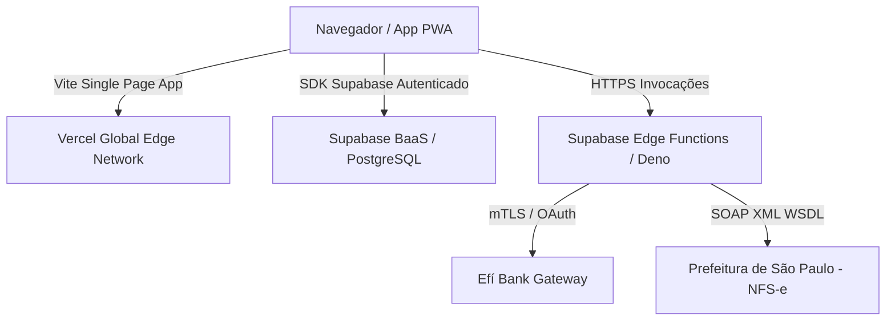

# Guia de Deployment e Infraestrutura — MiseOn SaaS 🚀

Este documento descreve a arquitetura de implantação, pipelines de integração contínua (CI/CD) e procedimentos de deploy para a plataforma MiseOn.

---

## 1. Visão Geral da Infraestrutura

O MiseOn adota uma arquitetura Cloud-Native e Serverless de alta performance:



---

## 2. Ambientes de Implantação

| Ambiente | Provedor Frontend | Provedor Backend / Database | Edge Functions |
|---|---|---|---|
| **Desenvolvimento Local** | Vite Dev Server (`localhost:5173`) | Supabase CLI (`supabase start`) | Deno Serve Local |
| **Staging / Homologação** | Vercel Preview Deployments | Supabase Project (Staging) | Supabase Edge (Sandbox) |
| **Produção** | Vercel Production (`miseon.app.br`) | Supabase Production Project | Supabase Edge (Production) |

---

## 3. Pipeline de Deploy Frontend (Vercel)

### Deploy Automático via GitHub Actions
O repositório possui integração contínua configurada em `.github/workflows/ci.yml`.

1. **Gatilho**: Push para a branch `main` ou Pull Requests.
2. **Quality Gate**:
   - ESLint Zero-Warning Policy (`npm run lint`)
   - Checagem de Tipos TypeScript (`npm run typecheck`)
   - Bateria de Testes Unitários (`npm test`)
   - Varredura Automática de Segredos (`node scripts/verificar-segredos.mjs --tudo`)
3. **Build e Deploy**:
   - `npm run build` (`tsc -b && vite build`)
   - Vercel CLI / Integration realiza o deploy dos artefatos estáticos da pasta `dist/`.

---

## 4. Deploy de Edge Functions (Supabase / Deno)

As Edge Functions da plataforma são executadas no runtime Deno da rede Supabase Edge Functions.

### Lista de Edge Functions Ativas
- `saas-assinar`: Processamento de assinaturas via cartão de crédito.
- `saas-pix`: Geração e consulta de cobranças Pix de mensalidade.
- `pix-criar-cobranca`: Cobranças Pix de pedidos de clientes finais com split.
- `pix-webhook`: Webhook para recepção de confirmações Pix do Efí Bank.
- `fiscal-emitir-nfse`: Emissão automatizada de NFS-e (Prefeitura de SP).
- `fiscal-pdf-nfse`: Geração de espelho PDF de NFS-e emitida.
- `fiscal-onboarding-plataforma`: Validação de certificados A1 e credenciais fiscais.

### Comando para Deploy de Edge Function
Para realizar o deploy de uma Edge Function para o ambiente de produção:

```bash
# Autenticar no Supabase CLI (uma única vez)
supabase login

# Deploy de todas as funções
supabase functions deploy --project-ref <SEU_SUPABASE_PROJECT_REF>

# Deploy de uma função específica
supabase functions deploy fiscal-emitir-nfse --project-ref <SEU_SUPABASE_PROJECT_REF>
```

---

## 5. Migrações de Banco de Dados (PostgreSQL / Supabase)

As tabelas, funções SQL e políticas RLS são gerenciadas via migrações versionadas em `supabase/migrations/`.

```bash
# Aplicar migrações pendentes no ambiente local
supabase db reset

# Aplicar migrações no projeto remoto de produção
supabase db push --project-ref <SEU_SUPABASE_PROJECT_REF>
```

---

## 6. Checklist de Lançamento em Produção

- [ ] Todas as variáveis de ambiente cadastradas no Vercel (`VITE_SUPABASE_URL`, `VITE_SUPABASE_ANON_KEY`, `VITE_MISEON_EFI_PAYEE_CODE`).
- [ ] Todos os segredos cadastrados via `supabase secrets set` (ver [docs/secrets.md](file:///c:/Users/rafae/Dev/MiseOn/docs/secrets.md)).
- [ ] Certificado Digital A1 da empresa e chave privada cadastrados no Supabase Vault.
- [ ] Domínio customizado (`miseon.app.br`) com SSL ativo e apontamento DNS verificado.
